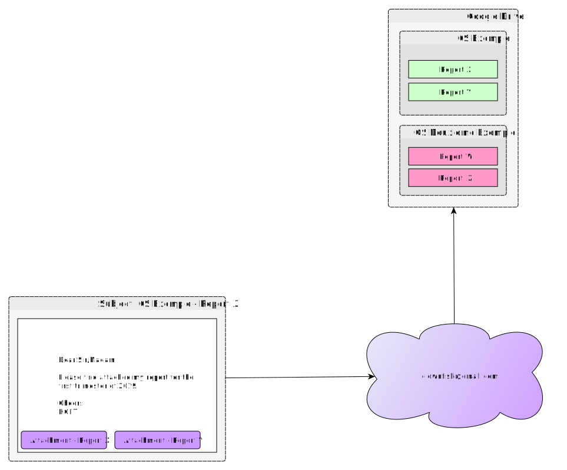

Clownfish
=========

This application is a relay between [imapflow](https://imapflow.com/) and [NextCloud](https://nextcloud.com/).  It receives messages from the IMAP server, downloads them, and archives them in NextCloud.  It is used for aggregating reports from health structures throughout IMA World Health's area of work.

# How it works

Send an email to the clownfish email address with the subject line `${structure} - ${report name}`.  The application will download any attachments on that email and upload them to NextCloud folder named `${structure}`.  If this folder does not exist, it will first create the folder and then upload the files to the folder.

## Overview


## Deploying with Docker

There is a Dockerfile in this repository.  Deploying with Docker is relatively simple.

```sh
# clone into clownfish dir
git clone https://github.com/IMA-WorldHealth/clownfish.git clownfish

cd clownfish

# build the docker file.  This will take a while.
docker build -t <user>/clownfish .

# deploy the docker file locally
docker run --expose 7171:9191 -d jniles/clownfish

# you can now connect to 127.0.0.1:9191 to connect to the local app instance
```

## License
[MIT](./LICENSE)
